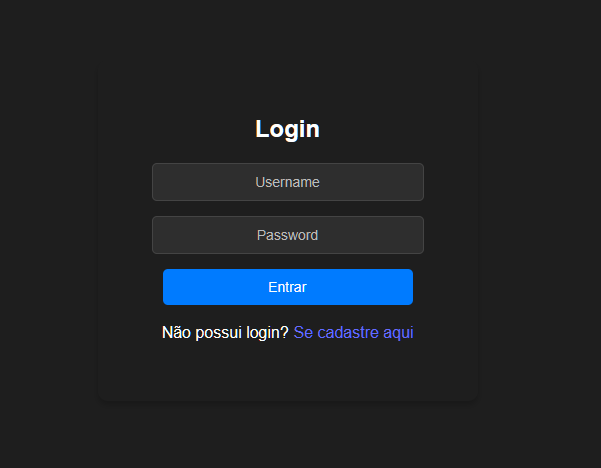

# 📋 Desafio Técnico Smart NX

Este é um projeto desenvolvido como parte de um desafio técnico para a vaga de **Full Stack Developer**. A aplicação consiste em uma plataforma que permite aos usuários autenticados criar, editar, excluir e visualizar posts e comentários.

## 🚀 Funcionalidades

- Registro de novos usuários.
- Login com autenticação JWT.
- Criação, edição e exclusão de posts.
- Adição, edição e exclusão de comentários.
- Navbar Lateral com nome específico do usuário logado.
- Feedback visual para ações como exclusão de posts ou comentários.
- Design responsivo, minimalista e moderno, com foco em usabilidade.

## 🛠️ Tecnologias Utilizadas

### Backend

- **Node.js**: Plataforma para execução do JavaScript no lado do servidor.
- **Express.js**: Framework para construção das APIs REST.
- **Sequelize**: ORM utilizado para interagir com o banco de dados.
- **PostgreSQL (Tembo.io)**: Banco de dados relacional, armazenado em nuvem.
- **JWT (JSON Web Token)**: Para autenticação segura.
- **dotenv**: Gerenciamento de variáveis de ambiente.

### Frontend

- **React.js**: Biblioteca para construção de interfaces de usuário.
- **React Router**: Gerenciamento de rotas.
- **Axios**: Para realizar requisições HTTP ao backend.
- **CSS customizado**: Estilização da aplicação.

### Ambiente de Desenvolvimento

- **Git**: Controle de versão.
- **Visual Studio Code**: Editor de código.
- **Tembo.io**: Banco de dados na nuvem.
- **Concurrently**: Para rodar frontend e backend simultaneamente.

---

## ⚙️ Como Executar o Projeto

### Pré-requisitos

Certifique-se de ter instalado:

- **Node.js**: [Download Node.js](https://nodejs.org/)
- **NPM** ou **Yarn**: Gerenciador de pacotes do Node.js.
- **Git**: Para clonar o repositório.

### Clonando o Repositório

```bash
git clone https://github.com/K010TE/projeto-snx.git
cd projeto-snx
```

### Configurando o Backend e o Frontend Simultaneamente

1. **Instale as dependências:**

   ```bash
   npm install
   ```

2. **Inicialize o backend e o frontend:**

   ```bash
   npm start
   ```

   - O backend será iniciado em `http://localhost:3333`.
   - O frontend será iniciado em `http://localhost:5173`.

### Executando os Servidores Separadamente (Opcional)

**Backend:**

```bash
cd backend
npm install
npm start
```

**Frontend:**

```bash
cd frontend
npm install
npm run dev
```

---

## 📄 Estrutura de Diretórios

```
📦 projeto-snx
├── backend
│   ├── src
│   │   ├── models
│   │   │   ├── Comment.js
│   │   │   ├── Post.js
│   │   │   ├── User.js
│   │   ├── auth.js
│   │   ├── database.js
│   │   └── index.js
│   ├── .env
│   ├── package.json
│   ├── package-lock.json
├── frontend
│   ├── src
│   │   ├── components
│   │   │   ├── Navbar.jsx
│   │   │   └── Navbar.css
│   │   ├── pages
│   │   │   ├── Login.jsx
│   │   │   ├── Login.css
│   │   │   ├── Register.jsx
│   │   │   └── Register.css
│   │   ├── App.jsx
│   │   ├── App.css
│   │   ├── index.css
│   │   └── main.jsx
│   ├── public
│   ├── vite.config.js
│   ├── .gitignore
│   ├── package.json
│   └── package-lock.json
```

---

## 🔑 Informações de Autenticação e Banco de Dados

O backend utiliza autenticação JWT para proteger as rotas. Para acessar a aplicação:

- Registre-se na tela de **Registro**.
- Faça login na tela de **Login**.
- O banco de dados está configurado no Tembo.io, rodando 24h, para facilitar o processo de avaliação.

> **Nota:** Nenhum dado sensível foi exposto, e o banco é utilizado exclusivamente para este teste técnico.

---

## 📷 Screenshots

### Página de Login



### Página de Posts


---

## 🔍 Endpoints da API

### **Usuários**

#### Registro de Usuário

**POST** `/api/register`

- **Body:**
  ```json
  {
    "username": "string",
    "password": "string",
    "name": "string"
  }
  ```
- **Resposta:**
  ```json
  {
    "message": "Usuário registrado com sucesso."
  }
  ```

#### Login

**POST** `/api/login`

- **Body:**
  ```json
  {
    "username": "string",
    "password": "string"
  }
  ```
- **Resposta:**
  ```json
  {
    "token": "string",
    "userId": "number"
  }
  ```

### **Posts**

#### Listar Posts

**GET** `/api/posts`

- **Headers:**
  ```json
  {
    "Authorization": "Bearer <token>"
  }
  ```
- **Resposta:**
  ```json
  [
    {
      "id": "number",
      "title": "string",
      "content": "string",
      "userId": "number",
      "comments": [
        {
          "id": "number",
          "content": "string",
          "userId": "number"
        }
      ]
    }
  ]
  ```

#### Criar Post

**POST** `/api/posts`

- **Headers:**
  ```json
  {
    "Authorization": "Bearer <token>"
  }
  ```
- **Body:**
  ```json
  {
    "title": "string",
    "content": "string"
  }
  ```

#### Editar Post

**PUT** `/api/posts/:postId`

- **Headers:**
  ```json
  {
    "Authorization": "Bearer <token>"
  }
  ```
- **Body:**
  ```json
  {
    "title": "string",
    "content": "string"
  }
  ```

#### Deletar Post

**DELETE** `/api/posts/:postId`

- **Headers:**
  ```json
  {
    "Authorization": "Bearer <token>"
  }
  ```

### **Comentários**

#### Criar Comentário

**POST** `/api/posts/:postId/comments`

- **Headers:**
  ```json
  {
    "Authorization": "Bearer <token>"
  }
  ```
- **Body:**
  ```json
  {
    "content": "string"
  }
  ```

#### Editar Comentário

**PUT** `/api/posts/:postId/comments/:commentId`

- **Headers:**
  ```json
  {
    "Authorization": "Bearer <token>"
  }
  ```
- **Body:**
  ```json
  {
    "content": "string"
  }
  ```

#### Deletar Comentário

**DELETE** `/api/posts/:postId/comments/:commentId`

- **Headers:**
  ```json
  {
    "Authorization": "Bearer <token>"
  }
  ```

---

## Notas Importantes

- O arquivo `.env` já contém as credenciais públicas para acesso ao banco configurado para este projeto.
- Este projeto foi desenvolvido exclusivamente para fins de avaliação técnica e não faz use de nenhum dado sensível.

## Contato

- **Nome:** Itagiba Neto
- **LinkedIn:** linkedin.com/in/itagiba-neto

---
